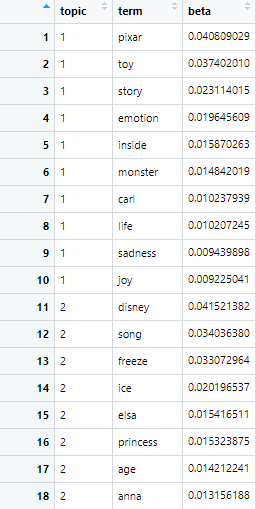
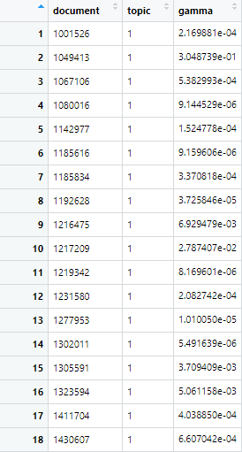
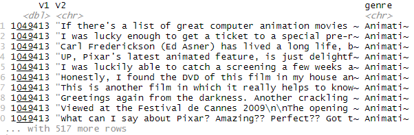
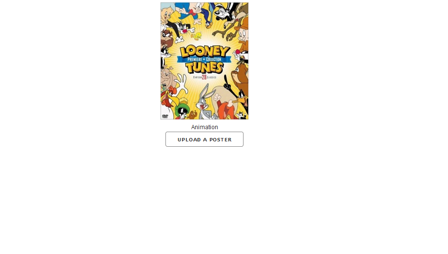
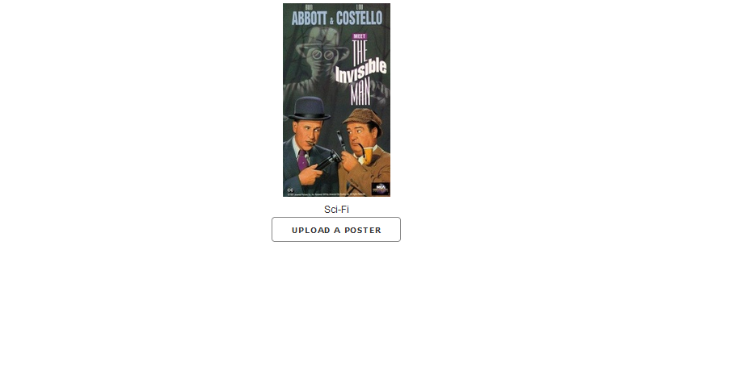
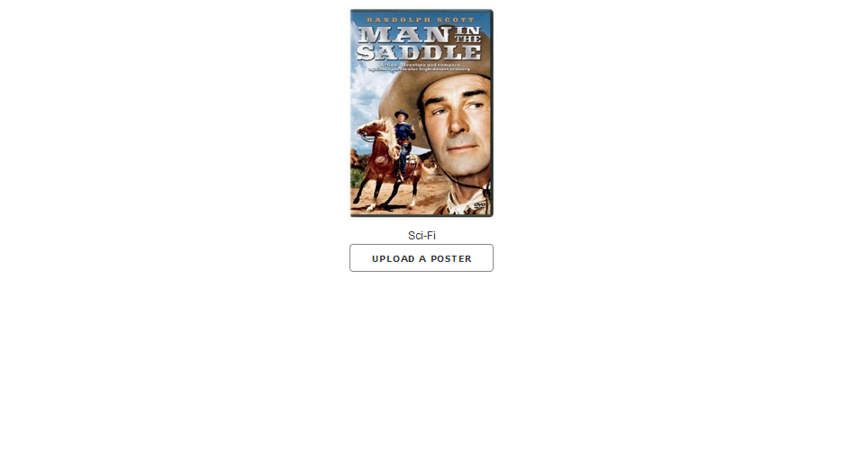

## Background
This repo contains my contributions to a group project completed as part of my 'Working with Unstructured Data' course. The project prompt was to complete an analysis on any form of unstructured data (i.e. images, videos, sound) from a business context. In this project, our team looked at ways to create insights from data in the movie industry. To approach this task, our plan was to look at both movie posters and reviews, and use methods in both image classification and NLP to examine these two forms of unstructured data

## Project Structure 
### Part 1: Movie Review Topic Models
As it stands, IMDB contains around 18 different genres of movies, with many movies having more than 1 genre. Due to time constraints and our data collection method, our group decided to limit the genres we hoped to examine to no more than 4. In order to give our image classification model a better chance of succeeding, we hoped to choose genres that had vastly different posters, in terms of structure (at least we hoped to, will be discussed later). In the end, we selected the four genres Animation, War, Western and Sci-Fi. These genres gave us a sufficient amount of poster and review data, and we believed they would have distinct enough differences to extrapolate to other genres. 

While I have completed topic models in Python, this was my first time completing them in R and was a good chance to observe the differences. Again, the concept of a topic model revolves around a Bayesian approach to understanding text from a NLP perspective. We start with the assumption that every sentence in the English language is composed around the structure of some arbitrary amount of topics. We then aim to calculate the distribution of topics in each sentence. Each "sentence" in our case is a document, and within the context of this project is a review. For example, say we have the sentence: "I really enjoyed Toy Story, the animation was terrific!". We can say that 60% of words belong to some Topic A, while 40% belong to some Topic B, for example. In order to run a topic model (Latent Dirichlet Allocation), we need to provide the alogrithm with a set of input. As seen in the file alex_topic.R, each genre received its own topic model with its own inputs. Before providing any input to the function, it was necessary to tokenize the documents, which creates a dataset linking each word to the document ID it appeared in. In order to improve the results/computation time of the topic models, each term was "lemmatized", which converts a word to its root form. For example, the word talking would become talk. After lemmatizing the words, the most popular and least popular 30 terms were removed. After this, a corpus of all words in our reviews and second, a document term matrix. This topic model was generated using the topicmodels package in R. Links to the LDAvis output of the topic models for each genre:

[Animation](https://htmlpreview.github.io/?https://github.com/alexilyin1/imdb_scraper/blob/master/LDAvis_html/LDAvis_animation.html)

[Sci-Fi](https://htmlpreview.github.io/?https://github.com/alexilyin1/imdb_scraper/blob/master/LDAvis_html/LDAvis_scifi.html)

[War](https://htmlpreview.github.io/?https://github.com/alexilyin1/imdb_scraper/blob/master/LDAvis_html/LDAvis_war.html)

[Western](https://htmlpreview.github.io/?https://github.com/alexilyin1/imdb_scraper/blob/master/LDAvis_html/LDAvis_western.html)

After producing these visualizations courtesy of the package LDAvis, I used some ggplot visualizations to take a deeper look at the composition of the different topics. Due to the time it takes to compute topic models, I settled on 15 topics with 50 iterations. Within the LDA function are two parameters, gamma and beta. Gamma allows us to look at the topic distribution among documents, while beta allows us to look at the word distributions among topics. By extracting the beta coefficients from the computed topic model, we can create plots to examine the "top" words in each topic by their beta score. For example, here is the output after extracting beta, as well as the plots for animation and western topic models:

These graphs reveal that a lot of topics are dominated by 1 or 2 movies. For example, looking at topic 2 in the animation plot reveals that this topic is dominated by the movie "Frozen". If we take a look at the Gamma variable, we can take a look at a specific document to see if we can "verify" the results of a model. Extracting the gamma coefficient gives us the following table:

Since the table gives us the document ID, we can filter the original dataset to try to "match" a topics top words ranked by beta to the preview of reviews that we see:

This document shows up second in the gamma table, and seems to have a large percentage of its text relating to topic 1. Looking at the first couple of reviews gives away that this is the famous Pixar movie "Up", and while it was not necessarily meant to be emotional, still drew out emotions from its viewers. Sure enough, if we look at the barplot for the Animation topics, we can see "Pixar", "emotion", "Carl" (one of the main characters in Up), "sadness" and "joy". As mentioned earlier, the most popular animation movies do dominate some topics, but this is to be expected as these movies are reviewed more than others. 

## Part 2: Image Classification
The next part of this project was to try and predict a movie's genre from its poster. To complete this task, I used a convolutional neural network. What separates a convolutional neural network from a typical neural network is the existence of so called "convolutional layers". With computers reading images at collections of 2/3D RGB value arrays, the convolutional layers use a window (kernel) to scan the numerical values that compose an image and try to define patterns. Intuitively, it seems that the best course of action is to create a gigantic neural network of only convolutional layers, but as with any machine learning model, this overcomplexity would result in severe overfitting. After playing around with a neural network written from scratch, I turned to some famous CNN architectures, such as the Alexnet and VGG16. These NNs have become famous after winning image classification competitions. While it may seem that any classification task can be solved using one of these models, they are extremely prone to overfitting and are extremely computationally expensive. Thankfully, the existence of the CUDA computation framework for Tensorflow neural networks greatly speeds up the computation of neural networks. 

With the size of our dataset not being big enough to warrant the use of a CNN like VGG16, we settled with the Alexnet. However, upon observing the images themselves, there was a clear problem: a lot of posters look like the could come from any of the four genres. For example, there are plenty of war movies that have animated posters, and plenty of animation movies that could be Sci-Fis. However, after a couple of edits to the model architecture (Python/model.py), I was able to achieve ~50% accuracy on a validation set. While this may seem like a trivial classifier, it is pretty impressive considering the similarities among movie posters.

After completing this model, I decided to deploy it as an "application", to allow for a user to upload an image and receive a classification. Since the goal of this project was not a webapp, I decided to simplify this process by using plotly's Dash framework. This allowed for a quick and dirty approach to creating a "web app". After creating the app, I used Heroku to deploy the app, which revealed a lot of challenges with deploying a neural network. Since the Alexnet is not exactly a "small" neural network, deploying it involves saving its weights to an hdf5 file, and then uploading the weights and a json file containing the model architecture to Heroku. With the weights file coming out to around 300mb in size, Heroku was not too fond of the idea, but after a long upload process, the model was ready to go. Here are some examples of some successful and not-so-successful outcomes:

