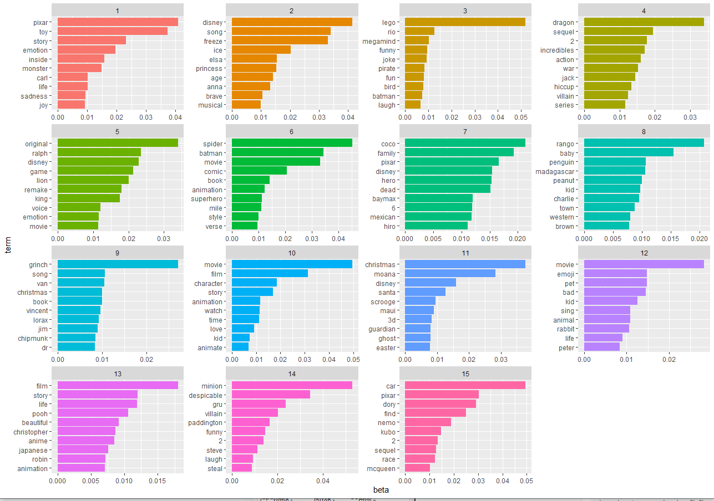
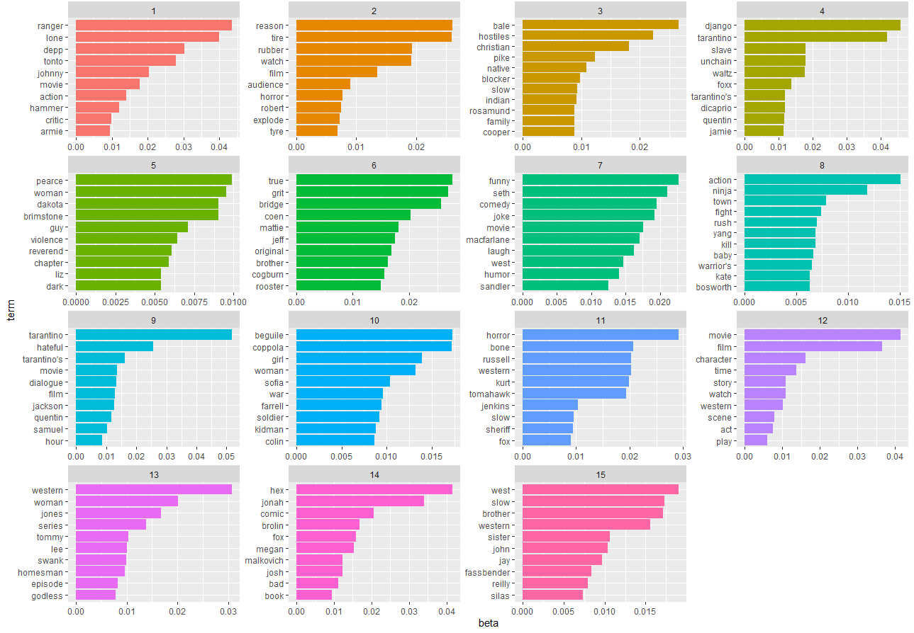

## Background
This repo contains my contributions to a group project completed as part of my 'Working with Unstructured Data' course. The project prompt was to complete an analysis on any form of unstructured data (i.e. images, videos, sound) from a business context. In this project, our team looked at ways to create insights from data in the movie industry. To approach this task, our plan was to look at both movie posters and reviews, and use methods in both image classification and NLP to examine these two forms of unstructured data

## Project Structure 
### Part 1: Movie Review Topic Models
As it stands, IMDB contains around 18 different genres of movies, with many movies having more than 1 genre. Due to time constraints and our data collection method, our group decided to limit the genres we hoped to examine to no more than 4. In order to give our image classification model a better chance of succeeding, we hoped to choose genres that had vastly different posters, in terms of structure (at least we hoped to, will be discussed later). In the end, we selected the four genres Animation, War, Western and Sci-Fi. These genres gave us a sufficient amount of poster and review data, and we believed they would have distinct enough differences to extrapolate to other genres. 

While I have completed topic models in Python, this was my first time completing them in R and was a good chance to observe the differences. Again, the concept of a topic model revolves around a Bayesian approach to understanding text from a NLP perspective. We start with the assumption that every sentence in the English language is composed around the structure of some arbitrary amount of topics. We then aim to calculate the distribution of topics in each sentence. Each "sentence" in our case is a document, and within the context of this project is a review. For example, say we have the sentence: "I really enjoyed Toy Story, the animation was terrific!". We can say that 60% of words belong to some Topic A, while 40% belong to some Topic B, for example. In order to run a topic model (Latent Dirichlet Allocation), we need to provide the alogrithm with a set of input. As seen in the file alex_topic.R, each genre received its own topic model with its own inputs. First, a corpus of all words in our reviews and second, a document term matrix. This topic model was generated using the topicmodels package in R. Links to the LDAvis output of the topic models for each genre:

[Animation](https://htmlpreview.github.io/?https://github.com/alexilyin1/imdb_scraper/blob/master/LDAvis_html/LDAvis_animation.html)

[Sci-Fi](https://htmlpreview.github.io/?https://github.com/alexilyin1/imdb_scraper/blob/master/LDAvis_html/LDAvis_scifi.html)

[War](https://htmlpreview.github.io/?https://github.com/alexilyin1/imdb_scraper/blob/master/LDAvis_html/LDAvis_war.html)

[Western](https://htmlpreview.github.io/?https://github.com/alexilyin1/imdb_scraper/blob/master/LDAvis_html/LDAvis_western.html)

After producing these visualizations courtesy of the package LDAvis, I used some ggplot visualizations to take a deeper look at the composition of the different topics. Due to the time it takes to compute topic models, I settled on 15 topics with 50 iterations. Within the LDA function are two parameters, gamma and beta. Gamma allows us to look at the topic distribution among documents, while beta allows us to look at the word distributions among topics. By extracting the beta coefficients from the computed topic model, we can create plots to examine the "top" words in each topic by their beta score. For example, here are the plots for animation and western topic models:

